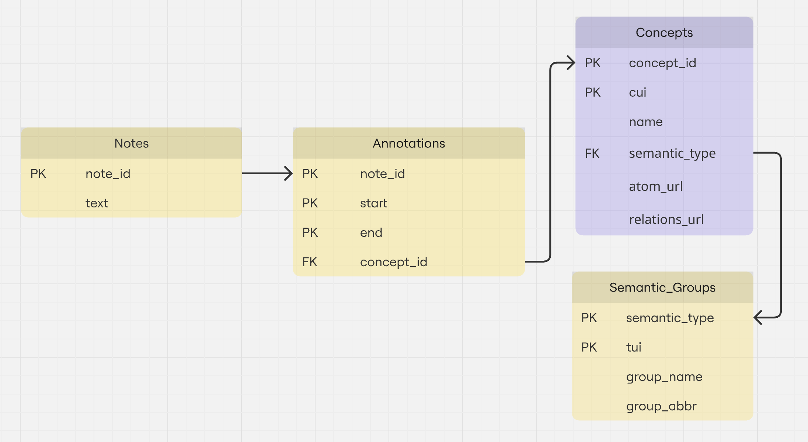

# Clinical Information Extraction from H&P Notes

This project focuses on extracting clinically relevant entities (e.g., conditions, procedures, findings) from History & Physical (H&P) notes using named entity recognition (NER) techniques. It leverages annotated clinical data with SNOMED CT concept IDs and aims to build a high-performance information extraction pipeline for real-world applications.

---

## Dataset
- **Source:** mimic-iv de-identified clinical notes.
- **Annotations:** Entity spans annotated with `start`, `end`, and `SNOMED CT concept_id`.
- **Example:**
  ```
  note_id,start,end,concept_id
  10060142-DS-9,179,190,91936005
  ```
- **Semantic Labels:** Concept IDs are mapped to entity types such as `CONDITION`, `PROCEDURE`, `FINDING`, etc.

---

## Workflow Overview

### 1. **Preprocessing**
- Load raw H&P text notes.
- Align token spans with annotated character offsets using `spaCy`tokenizer..

### 2. **Concept Mapping**
- Map each `concept_id` to an entity group (e.g., `PROCEDURE`, `CONDITION`) using: UMLS API

### 3. **NER Data Formatting**
- Convert aligned tokens into BIO-tagged format (e.g., `B-CONDITION`, `I-PROCEDURE`, `O`).
- Export training data in csv format.

### 4. **Model Training**
- Fine-tune a pretrained clinical language model (`BERT` as the baseline) using token classification.
- Train using Hugging Face Transformers pipelines.

### 5. **Evaluation**
- Evaluate using precision, recall, and F1-score at the entity level.
- Perform qualitative comparison against baseline model (`BERT`).

---

## AIM

- Build a robust, domain-adapted NER model for clinical entity extraction.
- Normalize extracted terms to SNOMED CT for downstream applications.
- Enable accurate information extraction from narrative clinical text, particularly H&P sections.

---

## Future Work

- Extend to relation extraction (e.g., link conditions to medications).
- Integrate negation and temporality detection.
- Deploy as a clinical text mining tool or API.

---

## Dependencies

- Python 3.8+
- `spaCy`, `transformers`, `pandas`, `scikit-learn`
- (Optional) `UMLS API`

Virtual environment setup:
```
# 1. Create the environment
conda create -n clinical-ner python=3.9 -y
conda activate clinical-ner

# 2. Install PyTorch and CUDA support via conda
pip3 install torch torchvision torchaudio --index-url https://download.pytorch.org/whl/cu118

# 3. Install the rest libraries via pip
pip install -r requirements.txt
```


## Notes

### Project Data Mart

We built a lightweight project data mart using SQLite to store and manage structured information related to annotated clinical notes, concept mappings, and semantic group metadata. The database schema captures relationships between notes, concept annotations, and semantic groupings to support downstream data analysis and querying. To populate the database with CSV data, you can use the SQLite command-line interface as follows:
```
sqlite3 database.sqlite
sqlite> .mode csv
sqlite> .import <csv_file> <table_name>
sqlite> .exit
```



### Run python script on HPC

Shell file template
```sh
#!/bin/bash
#SBATCH --partition=gpu
#SBATCH --gpus=a100:1
#SBATCH --cpus-per-task=4
#SBATCH --mem=10G                    # Request 10 GiB of memory
#SBATCH --time=12:00:00               # Set a maximum runtime of 6 hours
#SBATCH --output=logs/medical_ner_train_%j.out  # Save standard output to log file
#SBATCH --error=logs/medical_ner_train_%j.err   # Save error output to log file

# Run the Python script
python models/medical_ner_train.py

# Print job finish time
echo "Job finished at $(date)"
```

Authorize and run the job
```sh
chmod +x ~/run_medical_ner_train.sh
```
```sh
sbatch ~/run_medical_ner_train.sh
```
