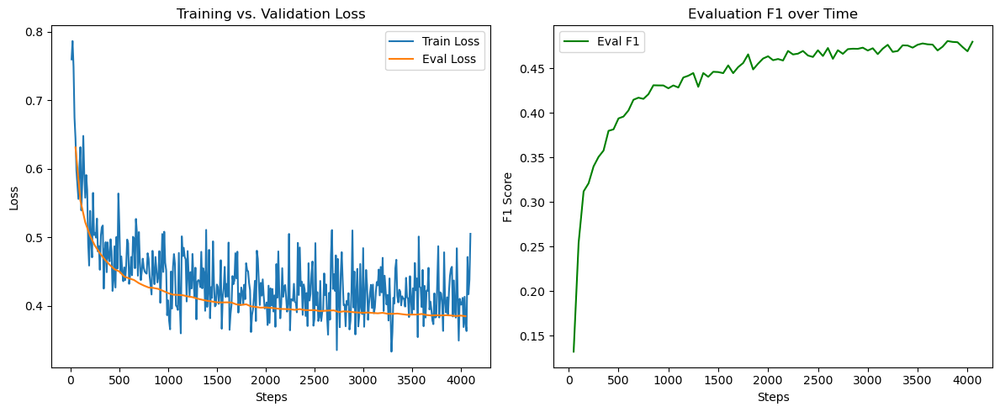
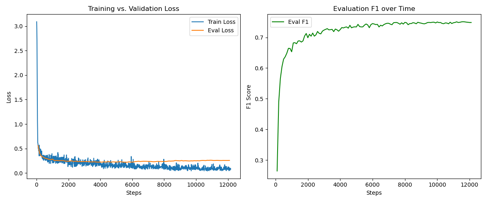

# Clinical Information Extraction from H&P Notes

This project focuses on extracting clinically relevant entities (e.g., conditions, procedures, findings) from History & Physical (H&P) notes using named entity recognition (NER) techniques. It leverages annotated clinical data with SNOMED CT concept IDs and aims to build a high-performance information extraction pipeline for real-world applications.

---

## Dataset
- **Source:** mimic-iv de-identified clinical notes.
- **Annotations:** Entity spans annotated with `start`, `end`, and `SNOMED CT concept_id`.
- **Example:**
  ```
  note_id,start,end,concept_id
  10060142-DS-9,179,190,91936005
  ```
- **Semantic Labels:** Concept IDs are mapped to entity types such as `CONDITION`, `PROCEDURE`, `FINDING`, etc.

---

## Workflow Overview

### 1. **Preprocessing**
- Load raw clinical notes.
- Align token spans with annotated character offsets.

### 2. **Concept Mapping**
- Map each `concept_id` to an entity group (e.g., `PROCEDURE`, `CONDITION`) using: UMLS API

### 3. **NER Data Formatting**
- Convert aligned tokens into BIO-tagged format (e.g., `B-CONDITION`, `I-PROCEDURE`, `O`).
- Export training data in csv format.


### 4. **Experimental Design**
- ✅ Model Baseline: pretrained `BERT`, `Clinical-BERT`, `DeBERTa`.
- ✅ Model Finetuning: `BERT`, `Clinical-BERT`, `DeBERTa` using Huggingface Transformer Training Pipeline.
- Model Fusion: the best baseline model + CRF.
- Model Ensemble: integrate prediction results from the three finetuning models.
- (Optional)Hybrid approaches: (GNN + Transformer embeddings).

Justification: This experimental design (1) systematically **evaluates transformer-based clinical NER** by benchmarking general and clinical-domain models, (2) enhancing them via **CRF-based fusion**, **ensemble modeling**, and (optional) integrating transformer embeddings with graph neural networks for semantic enrichment using clinical ontologies.

### 5. **Evaluation**
- ✅ Evaluate using precision, recall, and F1-score at the entity level.
- Perform qualitative comparison against baseline model (`BERT`).

### 6. **Post-processing**
* ✅ Minimal: Decode model outputs back to text and semantic tags (merge B/I, skip O)
* Good to have: Extract word-tag pairs
* Best to have: Map words to SNOMED CT terms

| **Goal**            | **Tool/Library**                                                                 | **Purpose**                                           |
|---------------------|----------------------------------------------------------------------------------|-------------------------------------------------------|
| Post-processing     | Transformer `pipeline`                                                              | Convert IOB/IO format to structured entities          |
| Extraction          | Python dictionary/set logic, `collections.defaultdict`                           | Aggregate by tags                                     |
| Normalization       | 🔹 **ScispaCy**, 🔹 **QuickUMLS**, 🔹 **BioPortal API**                            | Map raw terms to SNOMED CT                            |
| SNOMED CT Integration | 🔸 `pysnomed` (if you have a license) or 🔸 FHIR terminology server              | Lookup and standardize with SNOMED CT concept codes   |

---

## AIM

- Build a robust, domain-adapted NER model for clinical entity extraction.
- Normalize extracted terms to SNOMED CT for downstream applications.
- Enable accurate information extraction from narrative clinical text, particularly H&P sections.

---
## Results - Baseline (Feature Extraction)
|               | Accuracy | Precision | Recall | F1     |
|---------------|----------|-----------|--------|--------|
| BERT          | 0.8732	 | 0.4909    | 0.4690 | 0.4797 |
| Clinical-BERT | **0.8864**	 | 0.5314    | 0.5456 | **0.5384** |
| DeBERTa       | 0.8787	 | 0.5207    | 0.4942 | 0.5071 |

Notes: `Clinical-BERT` validation loss has reached its "local minimum", but the evaluation metrics are still terrible. `deBerta` has very fluctuating training loss curve, while the evaluation metrics shows that it truely has the best potential to predict the token classification on the baseline.

Figure 1: Bert baseline

Figure 2: DeBerta baseline


## Results - Model Fine-tuning
|               | Accuracy | Precision | Recall | F1     |
|---------------|----------|-----------|--------|--------|
| BERT          | 0.9288   | 0.72      | 0.78   | 0.74   |  
| Clinical-BERT | 0.9315   | 0.72      | 0.79   | **0.75**   |    

Training progress of clinical-BERT:

Figure 3: Clinical-Bert Finetuning


We also validate the metrics for each semantic tags we have:
### BERT
| Label | Precision | Recall | F1-score | Support |
|-------|-----------|--------|----------|---------|
| ACTI  | 0.67      | 0.59   | 0.62     | 17      |
| ANAT  | 0.63      | 0.72   | **0.67**     | 755     |
| CHEM  | 1.00      | 0.75   | **0.86**     | 4       |
| CONC  | 0.54      | 0.56   | 0.55     | 66      |
| DISO  | 0.76      | 0.82   | **0.79**     | 5023    |
| OBJC  | 0.67      | 0.50   | 0.57     | 4       |
| PHEN  | 0.50      | 0.04   | 0.08     | 23      |
| PHYS  | 0.83      | 0.73   | **0.77**     | 85      |
| PROC  | 0.63      | 0.71   | **0.67**     | 1938    |
| UNK   | 0.35      | 0.30   | 0.32     | 27      |

**Averages**:

| Metric        | Precision | Recall | F1-score | Support |
|---------------|-----------|--------|----------|---------|
| Micro avg     | 0.71      | 0.78   | 0.74     | 7942    |
| Macro avg     | 0.66      | 0.57   | 0.59     | 7942    |
| Weighted avg  | 0.72      | 0.78   | **0.74**     | 7942    |

Observations:
* Strong labels: DISO, PHYS, ANAT, PROC show solid F1 (0.67–0.79) — the model is doing well on high-frequency clinical entities.
* Weak labels: PHEN, UNK, and low-support labels like CHEM, OBJC — likely due to data ambiguity.
* Macro F1 = 0.59 → some labels are dragging down the average
* Weighted F1 = 0.74 → good overall performance weighted by label frequency

### ClinicalBERT
| Label    | Precision | Recall | F1-score | Support |
|----------|-----------|--------|----------|---------|
| ACTI     | 0.67      | 0.59   | 0.62     | 17      |
| ANAT     | 0.67      | 0.72   | 0.69     | 752     |
| CHEM     | 1.00      | 1.00   | **1.00**     | 4       |
| CONC     | 0.54      | 0.57   | 0.55     | 65      |
| DISO     | 0.76      | 0.83   | **0.79**     | 4973    |
| OBJC     | 0.75      | 0.75   | **0.75**     | 4       |
| PHEN     | 0.08      | 0.04   | 0.06     | 23      |
| PHYS     | 0.77      | 0.74   | **0.75**     | 84      |
| PROC     | 0.66      | 0.73   | **0.69**     | 1919    |
| UNK      | 0.57      | 0.30   | 0.39     | 27      |

**Averages**:

| Metric    | Precision | Recall | F1-score | Support |
|----------|-----------|--------|----------|---------|
| Micro Avg   | 0.72      | 0.79   | 0.76     | 7868    |
| Macro Avg    | 0.65      | 0.63   | 0.63     | 7868    |
| Weighted Avg | 0.72      | 0.79   | 0.75     | 7868    |

### Summary
| Averaging    | Metric     | BERT   | ClinicalBERT  |
|--------------|------------|--------|---------------|
| Micro Avg    | Precision  | 0.71   | **0.72**     |
|     | Recall     | 0.78   | **0.79**     |
|     | F1-score   | 0.74   | **0.76**     |
| Macro Avg    | Precision  | **0.66**   | 0.65      |
|     | Recall     | 0.57   | **0.63**     |
|     | F1-score   | 0.59   | **0.63**     |
| Weighted Avg | Precision  | 0.72   | 0.72        |
|  | Recall     | 0.78   | **0.79**     |
|  | F1-score   | 0.74   | **0.75**     |


---

## Post-processing Pipeline
We built a post-processing pipeline that enables:

- ✅ Inference on **any input clinical text** (not limited to training/validation sets)
- ✅ Efficient execution on **CPU devices**
- ✅ Using HuggingFace `transformers` `pipeline`
- ✅ Automatic **aggregation** and **semantic tag decoding**
- ✅ Available as a **command-line app** for convenient batch processing or scripting

The command-line app (`post_processing/decoding_pipeline.py`) takes the following inputs:
```
usage: decoding_pipeline.py [-h] --model_name MODEL_NAME [--finetune] --input_file INPUT_FILE --output_file OUTPUT_FILE

Run NER inference using a fine-tuned Transformer model

optional arguments:
  -h, --help            show this help message and exit
  --model_name MODEL_NAME
                        Options: bert, clinicalbert, deberta
  --finetune            Use the fine-tuned model (if set), otherwise use the baseline
  --input_file INPUT_FILE
                        Path to input .txt file containing clinical text
  --output_file OUTPUT_FILE
                        Path to output .txt file where predictions will be saved

```
Example Usages:
```
# Use baseline
python decoding_pipeline.py --model_name bert --input_file note.txt --output_file out.txt

# Use fine-tuned model
python decoding_pipeline.py --model_name bert --finetune --input_file note.txt --output_file out.txt
```

The following is one example input text from real H&P:
```
Patient reported that he has been having diarrhea which she described as liquid stools with incontinence.  
He also reported burning in the urine.  
He has been taking all of his medications including Bumex, colchicine 
```
The corresponding output would be:
```
dia -> DISO (score: 1.00)
##rrhea -> DISO (score: 1.00)
liquid stools -> DISO (score: 0.98)
incontinence -> DISO (score: 0.98)
burning in the urine -> DISO (score: 1.00)
medications -> PROC (score: 0.57)
```

---

## Future Work

- Extend to relation extraction (e.g., link conditions to medications).
- Integrate negation and temporality detection.
- Deploy as a clinical text mining tool or API.

---

## Dependencies

- Python 3.8+
- `spaCy`, `transformers`, `pandas`, `scikit-learn`
- (Optional) `UMLS API`

Virtual environment setup:
```
# 1. Create the environment
module load miniconda
conda create -n clinical-ner python=3.9 -y
conda activate clinical-ner

# 2. Install PyTorch and CUDA support
pip3 install torch torchvision torchaudio --index-url https://download.pytorch.org/whl/cu118

# 3. Install the rest libraries via pip
pip install -r requirements.txt
```


## Tips and Issue Handling

### Project Data Mart

We built a lightweight project data mart using SQLite to store and manage structured information related to annotated clinical notes, concept mappings, and semantic group metadata. The database schema captures relationships between notes, concept annotations, and semantic groupings to support downstream data analysis and querying. To populate the database with CSV data, you can use the SQLite command-line interface as follows:
```
sqlite3 database.sqlite
sqlite> .mode csv
sqlite> .import <csv_file> <table_name>
sqlite> .exit
```


### Setup jobs on HPC

Shell script template
```sh
#!/bin/bash
#SBATCH --partition=gpu
#SBATCH --gpus=a100:1
#SBATCH --cpus-per-task=4
#SBATCH --mem=10G                               # Request 10 GiB of memory
#SBATCH --time=6:00:00                         # Set a maximum runtime of 6 hours
#SBATCH --output=logs/medical_ner_train_%j.out  # Save standard output to log file
#SBATCH --error=logs/medical_ner_train_%j.err   # Save error output to log file

# Run the Python script
python models/medical_ner_train.py

# Print job finish time
echo "Job finished at $(date)"
```

Authorize and run the job
```sh
chmod +x ~/run_medical_ner_train.sh
```
```sh
sbatch ~/run_medical_ner_train.sh
```
### Issue I: deBerta attention score overflow
Open the file directly in Terminal with an editor (replace the virtual environment name with yours)
```bash
vim ~/.conda/envs/clinical-ner/lib/python3.9/site-packages/transformers/models/deberta/modeling_deberta.py
```
To search for specific line number: type `:290` and press Enter.<br>
In vim: Press `i` to switch to `__INSERT__` mode.<br>
Replace the following code:
```
attention_scores = attention_scores.masked_fill(~(attention_mask), torch.finfo(query_layer.dtype).min)
```
with this line:
```
attention_scores = attention_scores.masked_fill(~(attention_mask), -1e04)
```
Save and exit the file: Press `Esc`, type `:wq`, then press `Enter`.

